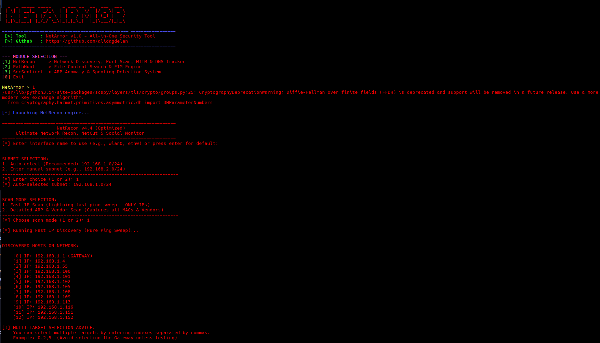
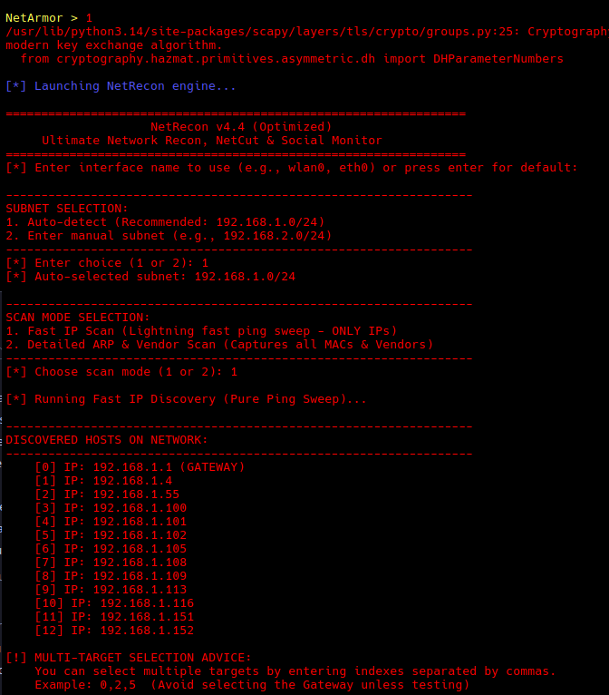
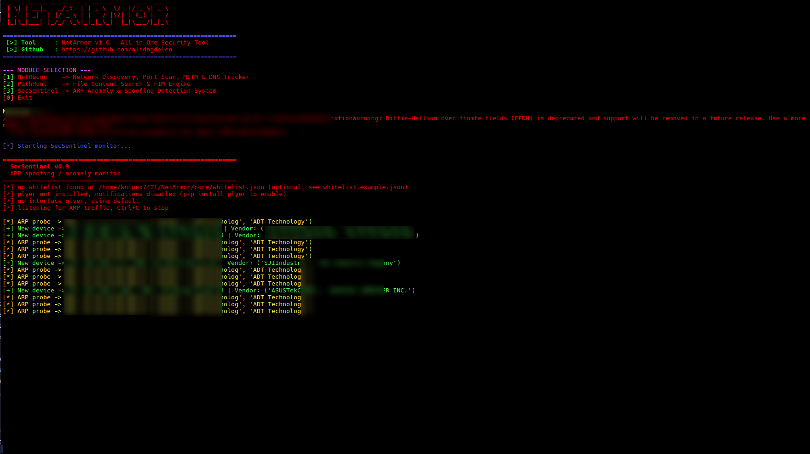

# NetArmor - All-in-One Network Security & Reconnaissance Toolkit

**NetArmor** is a modular, terminal-based security suite designed for network reconnaissance, file integrity monitoring, and ARP anomaly detection. It consolidates multiple security engines into a unified CLI tool for penetration testing, red teaming, and local network monitoring.

Developed by: [ali dagdelen](https://github.com/alidagdelen)

---

## Screenshots

| Main Interface | NetRecon Engine | SecSentinel Monitor |
| :---: | :---: | :---: |
|  |  |  |

---

## Key Modules

NetArmor integrates three core modules under a single interface[cite: 1, 2, 3]:

* **NetRecon Engine (`netracon.py`)**:
  * Fast ping sweep and detailed ARP/Vendor host discovery[cite: 1].
  * Multi-target concurrent port scanning[cite: 1].
  * Full-duplex ARP Spoofing / MITM capabilities[cite: 1].
  * NetCut mode to isolate targets from gateway traffic[cite: 1].
  * Live DNS query sniffing with real-time domain alert triggers[cite: 1].

* **PathHunt Engine (`pathHunt.py`)**:
  * File search by filename or content keyword across specified directories.
  * Configurable file extension filter[cite: 2].
  * Built-in File Integrity Monitoring (FIM) interface[cite: 2].

* **SecSentinel Monitor (`SecSentinel.py`)**:
  * Passive ARP packet inspection for local network monitoring[cite: 3].
  * Detection of IP/MAC mismatches and potential spoofing attempts[cite: 3].
  * Whitelist support for critical network devices[cite: 3].
  * Event logging in standard JSON/JSONL formats[cite: 3].

---

## Directory Structure

Ensure your repository is structured as follows:

```text
NetArmor/
├── main.py
├── README.md
├── assets/
│   ├── mainp1.png
│   ├── mainp2.png
│   └── mainp3.png
└── core/
    ├── __init__.py
    ├── netracon.py
    ├── pathHunt.py
    └── SecSentinel.py
